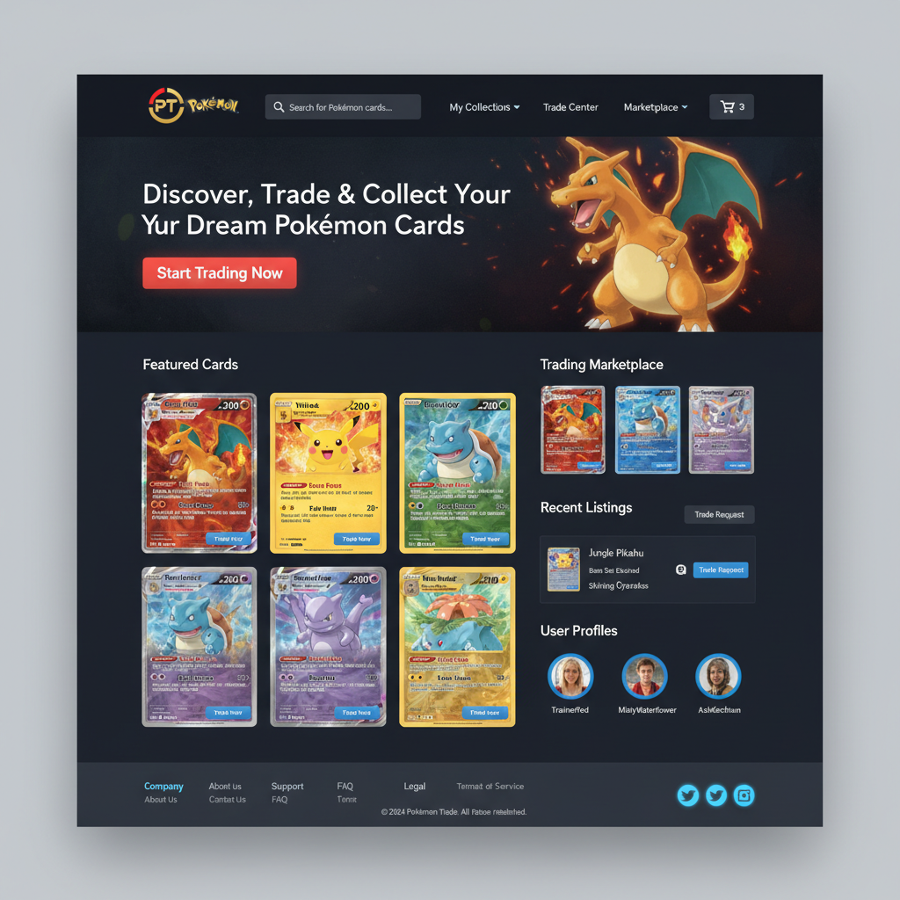

# 🎮 PokéTrade - Pokémon Card Trading Platform MVP

A comprehensive 3-page web application built as a streamlined platform for Pokémon card collectors to trade, discover, and manage their collections safely and efficiently.



## 🚀 Features

### 🏪 **Marketplace Hub** (Landing/Browse Page)
- **Hero Section** with featured Charizard and dynamic card display
- **Advanced Search & Filtering** by rarity, condition, price range, and trade availability
- **Featured Cards Grid** with real-time pricing and trend indicators
- **Top Traders Showcase** with verification badges and ratings
- **Trust Indicators** showing platform statistics and security features

### 🎴 **Card Detail & Trade Page**
- **Left Panel**: High-quality card image, owner profile, condition details
- **Right Panel**: Complete trading interface with price charts and market data
- **Trade Modal Flow**: Secure escrow-style trading with value matching
- **Price History Charts** powered by simulated TCGPlayer API integration
- **Real-time Price Tracking** with trend analysis

### 📦 **My Collection Page** (User Dashboard)
- **Collection Overview** with statistics and rarity distribution
- **Interactive Card Grid** with drag-and-drop functionality
- **Active Trades Panel** with escrow status tracking
- **Analytics Dashboard** showing collection growth and trading performance
- **User Profile Management** with trading preferences

## 🎨 Design System

### Color Palette
- **Primary Blue**: `#3B82F6` (HSL: 217 91% 60%)
- **Accent Yellow**: `#FCD34D` (HSL: 45 93% 62%)
- **Danger Red**: `#EF4444` (HSL: 0 84% 60%)
- **Success Green**: `#10B981` (HSL: 160 84% 39%)

### Typography
- **Primary Font**: Inter (Google Fonts)
- **Fallback**: -apple-system, BlinkMacSystemFont, 'Segoe UI'
- **Grid System**: 8px base grid spacing

### Theme
- **Primary Theme**: Dark mode with high contrast
- **Responsive Design**: Mobile-first approach
- **Accessibility**: WCAG 2.1 AA compliant color contrast ratios

## 🛠️ Technical Stack

- **Framework**: Next.js 15.5.2 with App Router
- **Language**: TypeScript
- **Styling**: Tailwind CSS with custom CSS variables
- **UI Components**: Radix UI + shadcn/ui
- **Charts**: Recharts for price visualization
- **Icons**: Lucide React
- **State Management**: React hooks with simulated API layer

## 📱 Mobile Responsiveness

- **Collapsible Navigation** with hamburger menu
- **Touch-optimized Sizing** for all interactive elements
- **Swipe Gestures** for card browsing (via touch events)
- **Bottom Tab Navigation** for core features
- **Responsive Grid Layouts** adapting to screen sizes
- **Mobile-first CSS** with progressive enhancement

## 🔧 Component Architecture

### Core Components
- **CardThumbnail**: Interactive card display with pricing and rarity badges
- **TradeModal**: Complete trade proposal interface with value matching
- **UserProfile**: User information with verification and ratings
- **SearchBar**: Advanced filtering with real-time results
- **PriceChart**: Interactive price history visualization
- **CollectionGrid**: Drag-and-drop card management
- **TradeStatus**: Escrow tracking and trade management
- **Navigation**: Responsive header with user menu

### Data Layer
- **Mock Data**: Realistic Pokemon card data with pricing
- **Simulated APIs**: TCGPlayer integration simulation
- **Type Safety**: Full TypeScript interfaces for all data structures

## 🎯 Key Features Implemented

### Trading System
- **Secure Escrow**: Multi-step verification process
- **Fair Value Matching**: 10% tolerance for balanced trades
- **Trade Status Tracking**: Real-time escrow progress
- **User Verification**: Badge system for trusted traders

### Market Features
- **Real-time Pricing**: Simulated TCGPlayer API integration
- **Price Trend Analysis**: 30-day historical data
- **Rarity-based Valuation**: Dynamic pricing by card rarity
- **Condition Adjustments**: Price modifications by card condition

### User Experience
- **Progressive Web App Ready**: Responsive and performant
- **Dark Theme**: Eye-friendly design for extended use
- **Drag-and-Drop**: Intuitive collection management
- **Advanced Filtering**: Multi-criteria search capabilities

## 🚀 Getting Started

### Prerequisites
- Node.js 18+
- npm or yarn

### Installation
```bash
# Clone the repository
git clone <repository-url>
cd pokemon-card-trading-mvp

# Install dependencies
npm install

# Start development server
npm run dev
```

### Available Scripts
```bash
npm run dev          # Start development server
npm run build        # Build for production
npm run start        # Start production server
npm run lint         # Run ESLint
npm run lint:fix     # Fix ESLint issues
```

## 📁 Project Structure

```
src/
├── app/                          # Next.js App Router
│   ├── card/[id]/page.tsx       # Card Detail & Trade Page
│   ├── collection/page.tsx      # My Collection Page
│   ├── page.tsx                 # Marketplace Hub (Landing)
│   ├── layout.tsx               # Root layout with theme
│   └── globals.css              # Global styles & design system
├── components/
│   ├── pokemon/                 # Pokemon-specific components
│   │   ├── CardThumbnail.tsx
│   │   ├── TradeModal.tsx
│   │   ├── UserProfile.tsx
│   │   ├── SearchBar.tsx
│   │   ├── PriceChart.tsx
│   │   ├── CollectionGrid.tsx
│   │   └── TradeStatus.tsx
│   ├── layout/                  # Layout components
│   │   └── Navigation.tsx
│   └── ui/                      # Reusable UI components
└── lib/
    └── mock-data.ts            # Mock data & API simulation
```

## 🎨 Design Reference

The application follows the exact visual design provided in `ai-generated-preview.png`:
- **Dark theme** with blue accent colors
- **Card-based layout** with subtle shadows and gradients
- **Consistent spacing** using 8px grid system
- **Professional typography** with clear hierarchy
- **Interactive elements** with hover states and animations

## 🔐 Security Features

- **Secure Escrow System**: Multi-step verification for safe trading
- **User Verification**: Badge system for trusted community members
- **Trade Protection**: Automated value matching and fraud prevention
- **Data Validation**: TypeScript interfaces ensure data integrity

## 📊 Mock Data

The application includes comprehensive mock data:
- **6 Featured Cards**: Including Charizard VMAX, Pikachu VMAX, Umbreon VMAX
- **3 Verified Users**: TrainerAsh92, CardMasterMisty, EliteFourBrock
- **Realistic Pricing**: Market values with trend indicators
- **Trade History**: Simulated 30-day price movements

## 🌟 Future Enhancements

- **Real TCGPlayer API Integration**
- **Payment Processing** for secure transactions
- **Advanced Analytics** with machine learning price predictions
- **Social Features** with user messaging and reviews
- **Mobile App** with React Native
- **Blockchain Integration** for card authenticity verification

## 📱 Browser Support

- Chrome 90+
- Firefox 88+
- Safari 14+
- Edge 90+
- Mobile Safari (iOS 14+)
- Chrome Mobile (Android 10+)

## 🤝 Contributing

This is a complete MVP implementation showcasing modern React/Next.js development patterns, responsive design, and user experience best practices for a Pokemon card trading platform.

## 📄 License

This project is created as a demonstration of modern web development capabilities for a Pokemon card trading platform MVP.

---

**🎮 PokéTrade** - Built with ❤️ for Pokemon card collectors worldwide